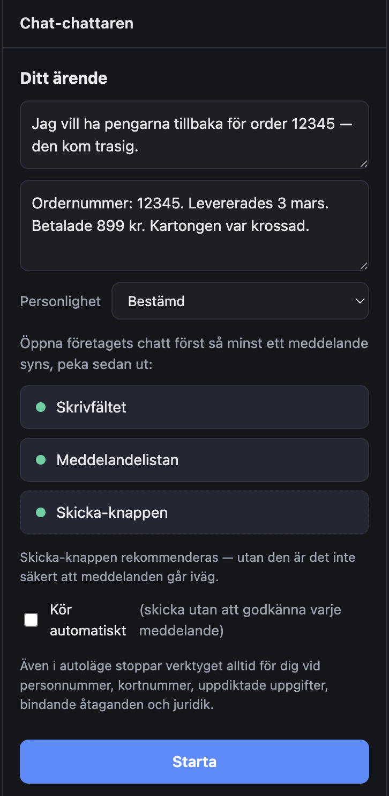
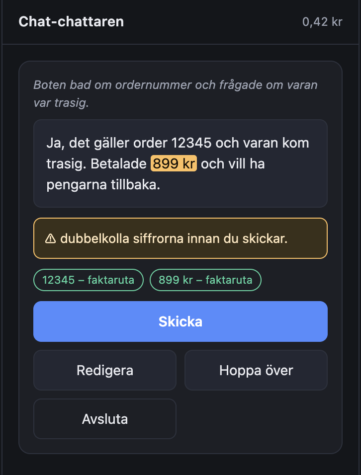
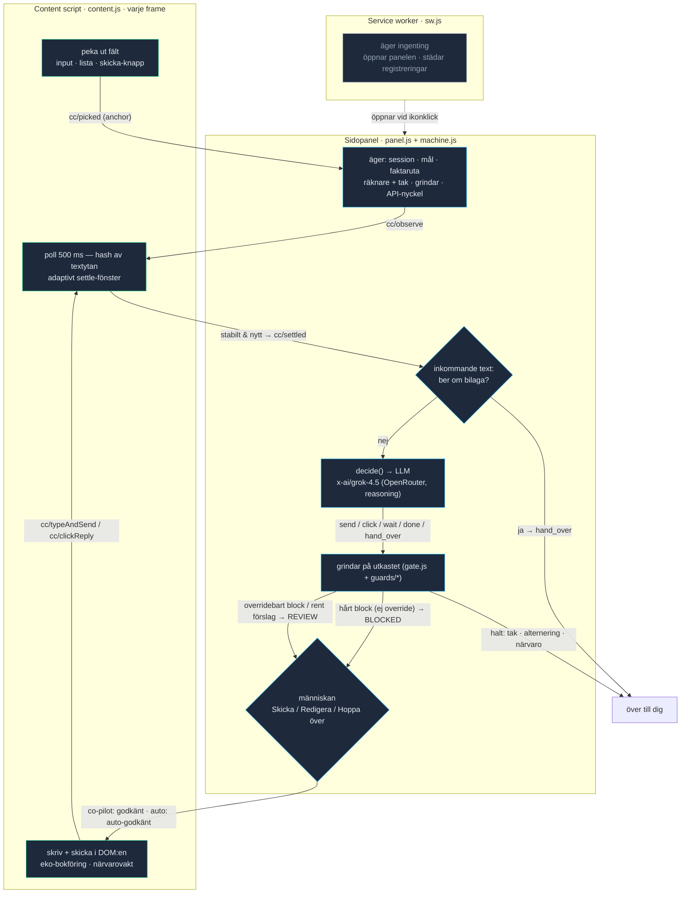

# Chat-chattaren

**Kundtjänstchatten som chattar åt dig.** Du hamnar i en supportchatt, skriver ditt ärende en gång — sedan tar en LLM över det tröttsamma fram-och-tillbaka-skrivandet med boten eller handläggaren, medan du gör något roligare.

[](https://www.patreon.com/AndersBjarby)

Ett Chrome-tillägg (MV3). Ingen server, ingen inloggning, ingen widget-magi som gissar sig fram: **du** pekar ut var i chatten fälten sitter, och tillägget sköter resten med din egen OpenRouter-nyckel. I standardläget föreslår det varje meddelande och du klickar **Skicka** — inget lämnar din dator utan att du sett det först.

## Så funkar det


*Sidopanelen: ditt ärende, faktarutan, en personlighet och de tre sakerna du pekar ut i chatten.*

1. Öppna företagets chatt själv, så att minst ett meddelande syns.
2. Klicka på tilläggets ikon — en **sidopanel** glider ut vid sidan av fliken.
3. Skriv ditt **ärende** ("pengarna tillbaka för order 12345 som kom trasig") och de **fakta** verktyget får använda.
4. **Peka ut tre saker** med musen: skrivfältet, meddelandelistan och skicka-knappen.
5. Klicka **Starta**. Första gången på en sajt frågar Chrome om tillägget får komma åt just den domänen — det är väntat, säg **Tillåt** (utan den behörigheten stannar sessionen så fort du laddar om sidan).
6. Verktyget läser motpartens svar och föreslår nästa meddelande. Du ser utkastet ordagrant och väljer **Skicka**, **Redigera**, **Hoppa över** eller **Avsluta**. Stänger du panelen dör sessionen direkt — det är din stoppknapp.


*Co-pilot-läget: förslaget visas ordagrant, siffror och ordernummer är källtaggade, och en varning dyker upp när något behöver din blick innan det går iväg.*

## Vad gör det speciellt

- **Du pekar, verktyget kör.** Ingen bräcklig auto-detektering av chattwidgets. Du klickar på fälten, och tillägget härleder robusta DOM-selektorer ur dina klick (Playwright-liknande rankning) och läker dem via fingeravtryck om sidan renderar om sig.
- **Når in där andra inte når.** Fungerar på vanliga inline-chattar, på öppna shadow-DOM-widgets (t.ex. IKEA:s `<syndeo-chat>`) och på chattar som ligger i en iframe på en annan domän. Den sistnämnda vägen är generisk — den riktar in sig på *formen* "cross-origin-iframe", inte på någon särskild leverantör. Widgets som Intercom och Zendesk har den formen, men de är exempel snarare än verifierade, testade integrationer.
- **Vet när det är dess tur.** Istället för att lita på ostabila events pollar verktyget textytans innehåll var 500:e millisekund och agerar först när svaret stått stilla — snabbt efter en pratsam ström, med längre tålamod efter en ensam ändring.
- **Kämpar ärligt, ger inte upp för lätt.** Möter det en trög bot trappar det upp metodiskt: omformulera skarpare → byta ord → prova nyckelord → använda botens egna menyknappar → be uttryckligen om en människa → åberopa dina **riktiga** konsumenträttigheter (ARN, Konsumentverket, öppet köp). Det är envishet med hederliga medel — **aldrig** försök att lura motparten att strunta i sina egna regler. Det funkar inte, och det är inte meningen.
- **Personligheter.** Sju toner att välja på, från balanserad till skämtsam. De färgar *hur* det låter — aldrig målet eller säkerheten.
- **Säkerhet i koden, inte bara i prompten.** Se nedan.

## Säkerhet — hårda spärrar i koden

Prompt-instruktioner kan luras. Därför sitter skyddet i riktig kod som körs på varje **utgående** meddelande, oavsett vad modellen råkade vilja skriva (`src/gate.js`, `src/guards/*`). Två sorters utslag:

**Hårda block — kan aldrig skickas, ingen "skicka ändå", gäller även i autoläget:**

- **Personnummer och kortnummer** (form + Luhn-kontroll, personnummer prövas först) → blockeras helt.
- **Kontonummer/IBAN** och **inloggningsuppgifter** (BankID, lösenord, engångskod, CVV, pinkod) → blockeras helt.
- **AI-förnekelse** ("jag är en människa") → blockeras helt. Ingen inställning återaktiverar det.

**Övervägningsbara utslag — hålls alltid kvar för din blick (även i autoläget), men du kan välja att skicka ändå med ett klick:**

- **Faktagrundning**: varje ordernummer, längre tal, belopp och mejladress i ett utkast måste finnas i din faktaruta eller i text som motparten själv skrev. Uppdiktade uppgifter stoppas och källtaggas i panelen så du ser varifrån varje siffra kommer. (Den hårda grinden granskar sifferföljder på tre tecken eller mer samt mejladresser; små tal som "2 dagar" eller "5 %" släpps igenom av grinden och hålls i schack av modellens prompt, inte av koden — så läs utkasten.)
- **Bindande åtaganden och juridik** (accepterar/godkänner/säger upp; ARN, skadestånd) → tvingas alltid fram till din granskning innan de kan gå iväg. Verktyget kan *skriva* "jag godkänner erbjudandet", men det skickas aldrig utan att du klickar Skicka.

**Överlämning — verktyget lägger tillbaka ratten hos dig:**

- **Bilaga-begäran** ("skicka en bild på varan") → lämnas över till dig; verktyget kan inte bifoga filer och låtsas aldrig annat. (Detta upptäcks på motpartens *inkommande* text, innan något utkast ens skrivs.)

**Sessionsspärrar:**

- **Strikt alternering**: aldrig två sändningar i rad utan ett nytt svar från motparten emellan.
- **Närvaro**: skriver eller klickar du själv i chatten, dör sessionen på fläcken.
- **Tak per session**: 15 meddelanden · 50 API-anrop · 20 minuter · ~0,75 USD i förbrukning · minst 3 sekunder mellan sändningar.

## Så är det byggt

Chat-chattaren lever i tre webbläsarkontexter, och de äger strikt åtskilda saker. Poängen är att den känsligaste biten aldrig hamnar i sidan du besöker.

**Sidopanelen** (`panel.js` + `src/machine.js`) äger sessionen: målet, faktarutan, alla räknare och tak, hela LLM-anropet — och din OpenRouter-nyckel. `machine.js` är en ren tillståndsmaskin (`RUNNING → DECIDING → REVIEW/BLOCKED → SENDING → RUNNING`) utan en rad chrome- eller DOM-kod; allt I/O går via injicerade `deps`, så den kan testas fristående. Här körs också alla grindar (`src/gate.js` + `src/guards/*`) och det mänskliga godkännandet. Stänger du panelen dör loopen — det är med flit.

**Content-scriptet** (`src/content.js`) körs i *varje* frame (`all_frames`) och äger DOM:en, aldrig nyckeln eller målet. Det sköter pekningen (`src/picker.js`), löser ankaren till selektorer med självläkning (`src/anchor.js`), och driver den billiga *settle-grinden*: istället för en opålitlig `MutationObserver` pollas textytans hash var 500:e ms tills den stått still. Väntefönstret är adaptivt — kort (~1 s) efter en avslutad textström, längre (~2,5 s) efter en ensam ändring. En eko-spårare skiljer vårt eget nyss skickade meddelande från ett nytt svar, och en närvarovakt stoppar allt så fort ett *äkta* tangenttryck eller klick (`isTrusted`) landar i chatten.

**Service workern** (`sw.js`) äger ingenting: ingen state, ingen fetch, ingen routing. Den öppnar bara panelen vid ikonklick och städar bort content-script-registreringar när en host-behörighet återkallas. Dör den mitt i en session händer ingenting.

Panelen pratar med rätt frame direkt via `chrome.tabs.sendMessage(..., { frameId })` — nödvändigt eftersom chattwidgetar ofta ligger i en cross-origin-iframe (den framens `frameId` lärs in vid pekning eller självregistrering).

Kärnloopen:



I autoläge auto-godkänns rena meddelanden och skickas direkt; ett *overridebart* grind-utslag (uppdiktad siffra, åtagande, juridik) tvingar ändå fram människan via REVIEW, och ett hårt utslag (personnummer, kortnummer, AI-förnekelse) kan aldrig skickas alls. Bilaga-begäran fångas ännu tidigare — på motpartens inkommande text, innan ett utkast ens skrivs — och lämnas över till dig. Grindens `halt` gäller bara sessionsvillkoren (tak, alternering, närvaro), inte innehåll. Efter varje sänd rad väntar loopen på att pollningen ska rapportera ett *nytt* svar från motparten innan nästa varv — aldrig två sändningar utan att något kommit emellan.

## Installera (utvecklarläge)

Verktyget finns inte i Chrome Web Store — det laddas okpackat.

1. Gå till `chrome://extensions` och slå på **Utvecklarläge**.
2. Klicka **Läs in okpackad** och välj den här mappen.
3. Skapa en nyckel på [openrouter.ai/keys](https://openrouter.ai/keys) och fyll på lite kredit. Klistra in den i panelen.

**Om din nyckel:** som standard ligger den bara i minnet (`chrome.storage.session`) och rensas när du stänger webbläsaren. Kryssar du i **"kom ihåg"** sparas den istället på disk i klartext (`chrome.storage.local`) så att den överlever en omstart — bekvämt, men det är ett medvetet val med en verklig risk. Nyckeln bor alltid i panelen, aldrig i sidan du besöker.

Modell: `x-ai/grok-4.5` med reasoning påslaget (OpenRouter kör Grok med reasoning som standard) — den tänker igenom sina drag mot tröga bottar. Det kostar något: ett helt samtal landar på några kronor, och kostnadstaket ovan skyddar plånboken.

## Personligheter

Ton och stil, aldrig mål eller säkerhet:

- **Balanserad** — artig men bestämd, saklig och rak (standard).
- **Bestämd** — självsäker och kortfattad, accepterar inte undanflykter.
- **Glad** — varm och lättsam, men fokuserad på ärendet.
- **Eftertänksam** — lugn och reflekterande, ställer genomtänkta frågor.
- **Skämtsam** — lätt humor och en spjuveraktig ton, men målinriktad.
- **Velig** — obeslutsam och tvekande, landar ändå i ditt ärende.
- **Osäker** — försiktig och lite ursäktande, men envis nog att fråga vidare.

## Ärliga gränser

Det här är en fungerande prototyp — inte en granskad, färdig produkt. Läs det här innan du litar på det:

- **Utvecklarläge, okpackat.** Inte i Web Store, inte säkerhetsgranskat.
- **Många företags villkor förbjuder automatiserad kontakt.** Du agerar visserligen i ditt eget ärende, i din egen session, med din egen identitet — påtagligt annorlunda än skrapning — men villkoren skiljer sällan på det. Risken är verklig, och den är din.
- **Bara på HTTPS-sidor.** Behörigheterna gäller `https://*/*`; på en `http://`-sida laddas inte content-scriptet och ingenting händer.
- **Chrome frågar om behörighet per sajt.** Vid Start begär tillägget åtkomst till just den domänen (och chattens eventuella iframe-domäner). Nekar du den varaktiga behörigheten stannar sessionen så fort du laddar om fliken.
- **Din OpenRouter-nyckel:** i minnet som standard (rensas när webbläsaren stängs), men **på disk i klartext** om du kryssar i "kom ihåg".
- **Grok 4.5 med reasoning är inte gratis.** En session kostar några kronor; kostnadstaket bromsar, men noll blir det inte.
- **Stängda shadow-DOM-widgets går inte att nå** (ovanligt — leverantörer isolerar oftast med iframe istället).
- **På vissa widgetar räcker inte ett syntetiskt Enter** för att skicka. Peka därför ut skicka-knappen — den rekommenderas.
- **Väldigt långa, virtualiserade trådar** kan tappa toppen av historiken ur modellens kontext. För en nyss öppnad supportchatt är det inget problem.
- **Verktyget kan formulera sig klumpigt eller missförstå ett svar.** Håll faktarutan sann och läs utkasten.
- **Det förnekar aldrig att vara en AI.** Frågar någon rakt ut, lämnar det över till dig.

## Utveckling

```bash
./run-tests.sh              # hela testsviten: 55 tester (node --test, jsdom som dev-beroende)
python3 -m http.server 8199 # öppna sedan test/harness.html för DOM-tester i en riktig webbläsare
```

Arkitekturen håller ansvaret åtskilt: **sidopanelen** äger sessionen, LLM-anropet, alla säkerhetsgrindar och nyckeln (aldrig i sidan). **Content-scriptet** äger DOM:en och pollningsloopen. **Service workern** äger ingenting och får dö fritt. Se *Så är det byggt* ovan för hela bilden.

---

Skriver i ditt namn. Ljuger aldrig om att vara AI. Du godkänner varje meddelande. Ha kul med den där returen du sköt upp.
